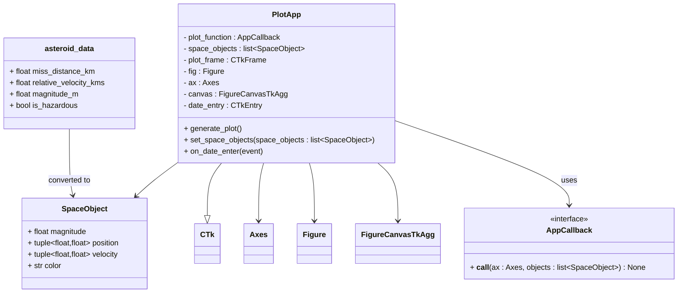

# informatik-logbog-demo
Min informatik logbog

# Forløb indtil videre:
I 1.D har gennemgået flg forløb indtil videre:
### Grundforløb:
App-lab, gestalt love, prototyper, brugertest (think-aloud)
### Programmering:
Variabler, løkker, kontrolstrukturer (if/else), lister. Sierpinski trekant kode, fysiksimuleringskode
### Kryptering:
Symmetrisk vs. Asymmetrisk kryptering, RSA, Caesar.

[Kryptografi](https://informatik.systime.dk/?id=810), [IT sikkerhed](https://informatik.systime.dk/?id=528), [CIA modellen](https://informatik.systime.dk/?id=844), [Basic gennemgang af RSA kryptering](https://www.geeksforgeeks.org/computer-networks/rsa-algorithm-cryptography/)

Vi lavede vist også et lille program til at kryptere/dekryptere beskeder - Der burde være et link til dig program i din logbog. :)

### 3D Design og print
Fusion, Cura (Creality CR10S-pro), Bambu studio (Bambu lab P2S)


# Når man får brug for at vide lidt mere om markdown:
Markdown er den syntaks man bruger på github til at lave readme filer... Den der forkant den betyder at det er en overskrift.
## cheatSheet til markdown:
[Her er et link til at lære om markdown](https://github.com/adam-p/markdown-here/wiki/markdown-cheatsheet)


# Jeg tester noget sygt ASCII-STL stuff her:
```stl
solid cube_corner
  facet normal 0.0 -1.0 0.0
    outer loop
      vertex 0.0 0.0 0.0
      vertex 1.0 0.0 0.0
      vertex 0.0 0.0 1.0
    endloop
  endfacet
  facet normal 0.0 0.0 -1.0
    outer loop
      vertex 0.0 0.0 0.0
      vertex 0.0 1.0 0.0
      vertex 1.0 0.0 0.0
    endloop
  endfacet
  facet normal -1.0 0.0 0.0
    outer loop
      vertex 0.0 0.0 0.0
      vertex 0.0 0.0 1.0
      vertex 0.0 1.0 0.0
    endloop
  endfacet
  facet normal 0.577 0.577 0.577
    outer loop
      vertex 1.0 0.0 0.0
      vertex 0.0 1.0 0.0
      vertex 0.0 0.0 1.0
    endloop
  endfacet
endsolid
```
#WHOAH! GEOJSON er også en ting!
```geojson
{
  "type": "FeatureCollection",
  "features": [
    {
      "type": "Feature",
      "id": 1,
      "properties": {
        "ID": 0
      },
      "geometry": {
        "type": "Polygon",
        "coordinates": [
          [
              [-90,35],
              [-90,30],
              [-85,30],
              [-85,35],
              [-90,35]
          ]
        ]
      }
    }
  ]
}
```

#Og Mermaid til diagrammer!



